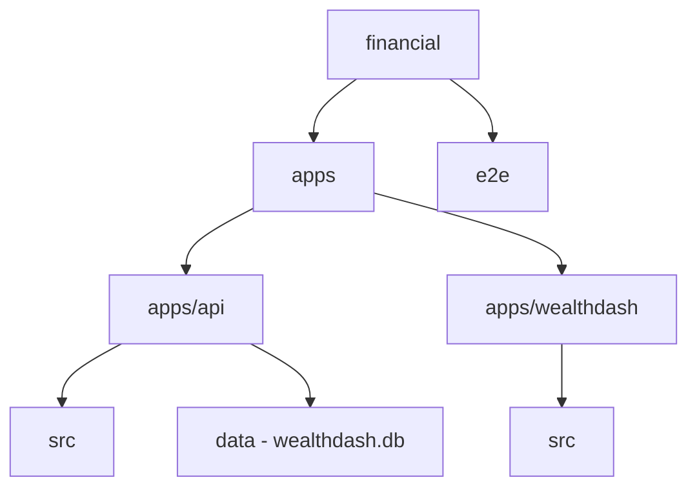

# 📊 WealthDash — Local Personal Wealth & Finance Dashboard

WealthDash adalah aplikasi web manajemen keuangan pribadi yang bersifat *privacy-first* dan *offline-first*. Aplikasi ini dirancang untuk memberikan kendali mutlak atas data keuangan, target tabungan, dan portofolio investasi saham Anda tanpa ketergantungan pada server cloud pihak ketiga. Seluruh data sensitif tersimpan secara lokal dan aman di dalam database SQLite lokal Anda.

---

## 🌟 Fitur Utama

Aplikasi WealthDash dilengkapi dengan fitur komprehensif untuk melacak kekayaan Anda secara holistik:

*   **🏠 Dashboard & Net Worth Tracker**: Pemantauan instan Kekayaan Bersih (*Net Worth*), Total Saldo Gabungan, Pemasukan/Pengeluaran bulan berjalan, serta grafik tren mutasi bulanan.
*   **💳 Dompet Saya (Multi-Wallet Management)**: 
    *   Pengelompokan dompet berdasarkan kluster likuiditas (`Liquid Cash` untuk rekening/kas harian, `Savings` untuk celengan/tabungan, dan `Investment` untuk RDN sekuritas).
    *   Pengelolaan data dompet baru, pengubahan nama (edit), dan penghapusan dompet secara aman.
    *   Halaman Detail Dompet yang menyajikan histori transaksi khusus untuk dompet yang dipilih.
*   **⇄ Transaksi Cerdas & Format Nominal Otomatis**:
    *   Pencatatan Pemasukan, Pengeluaran, dan Transfer Antar Dompet secara mudah.
    *   **Format Ribuan Otomatis (Real-Time)**: Input teks nominal secara otomatis memunculkan pemisah ribuan titik (`.`) saat mengetik untuk kenyamanan visual, serta memparsingnya kembali menjadi integer murni di backend.
    *   *Intelligent Transfer*: Perpindahan uang antar rekening internal tidak merusak grafik statistik arus kas bersih bulanan.
*   **🛡️ Sistem Proteksi Saldo (Balance Protection)**:
    *   Mencegah pengeluaran atau transfer keluar yang nominalnya melebihi isi saldo dompet terkait. Validasi dilakukan langsung oleh backend dan frontend secara sinergis untuk menjaga keamanan saldo.
*   **🛑 Manajemen Anggaran Bulanan (The Brake)**:
    *   Menetapkan batas alokasi pengeluaran per kategori. Dilengkapi visual progress bar dinamis yang berubah warna saat total pengeluaran mendekati atau melampaui batas anggaran.
*   **🔄 Target Tabungan dengan Defisit Akumulatif (The Gas)**:
    *   Fitur penentuan target nominal tabungan jangka panjang dengan opsi setoran rutin bulanan atau top-up instan.
    *   Sistem akumulasi defisit otomatis: jika setoran bulan ini terlewatkan, kekurangannya akan otomatis diakumulasikan ke target bulan berikutnya untuk mendorong kedisiplinan menabung.
*   **📈 Portofolio Investasi & RDN Tracker**:
    *   Pencatatan transaksi beli/jual saham dengan perhitungan harga beli rata-rata (*Average Price*).
    *   Sistem penjualan saham cerdas (*Unified Sell Action*) yang otomatis menghitung keuntungan/kerugian bersih (*Realized P&L*), memperbarui portofolio, dan mengkreditkan kembali uang hasil penjualan ke saldo RDN BCA Sekuritas.
    *   Manajemen transfer dana masuk/keluar ke dompet RDN.
    *   Pembaruan harga saham secara instan.
*   **📂 Ekspor & Reset Data**:
    *   Mengunduh seluruh data Transaksi, Dompet, dan Saham ke format spreadsheet Excel/CSV secara instan.
    *   Fitur Reset Data untuk mengosongkan seluruh riwayat database dalam satu kali klik melalui halaman Settings.

---

## 🏗️ Arsitektur Teknologi & Struktur Folder

WealthDash dibangun dengan struktur **Monorepo** yang modern, memisahkan backend dan frontend secara modular:



### Tech Stack
*   **Backend (API)**: Node.js, Express, Better-SQLite3 (WAL mode), tsx, Vitest.
*   **Frontend (Web Client)**: React 19, TypeScript, Vite, Vanilla CSS + TailwindCSS, Recharts (untuk grafik visual), Vitest + JSDOM.
*   **E2E Testing**: Playwright (Chromium Browser).

---

## 🚀 Panduan Instalasi & Pengoperasian

Ikuti langkah-langkah di bawah ini untuk menjalankan WealthDash di komputer lokal Anda:

### 1. Prasyarat Sistem
Pastikan Anda sudah menginstal **Node.js (versi LTS terbaru)** di komputer Anda.

### 2. Kloning Repositori & Install Dependensi
Buka terminal/command prompt, jalankan perintah berikut:
```bash
git clone https://github.com/OrangeJus/Wealthdash.git
cd Wealthdash
npm install
```

### 3. Inisialisasi Database Demonstrasi (Seeding)
Guna memberikan data percontohan agar visualisasi dashboard langsung terisi, jalankan perintah berikut untuk mengisi database SQLite awal:
```bash
npm run seed
```

### 4. Jalankan Aplikasi Server & Web
Jalankan kedua perintah berikut pada dua jendela terminal terpisah untuk mematangkan server lokal:

**Terminal 1 (Backend API):**
```bash
npm run dev:api
```
Backend API akan berjalan pada: `http://localhost:3001`

**Terminal 2 (Frontend Vite Web):**
```bash
npm run dev:web
```
Aplikasi web WealthDash akan terbuka secara otomatis pada browser di: `http://localhost:5173`

---

## 🧪 Panduan Menjalankan Sistem Pengujian (Testing Suite)

Proyek ini telah dilengkapi dengan sistem pengujian otomatis yang komprehensif di tiga lapisan:

*   **API & Integration Tests (Backend)**: 40 Pengujian API endpoint dan re-komputasi saldo.
*   **Unit Tests (Frontend)**: 17 Pengujian keandalan helper format angka ribuan.
*   **E2E UI Tests (Playwright Browser)**: 16 Simulasi skenario navigasi, transaksi, CRUD dompet, validasi form kosong, dan proteksi saldo di browser nyata.

### Perintah Pengujian (CLI):

| Jenis Pengujian | Perintah CLI | Penjelasan |
| :--- | :--- | :--- |
| **Menjalankan Seluruh Unit & API Tests** | `npm run test` | Menjalankan seluruh pengujian backend & frontend unit secara ringkas. |
| **Backend Integration Tests** | `npm run test:api` | Menjalankan pengujian endpoint API saja menggunakan database khusus `wealthdash-vitest.db`. |
| **Frontend Unit Tests** | `npm run test:web` | Menjalankan unit test helper parsing nominal uang menggunakan JSDOM. |
| **Playwright E2E UI Tests** | `npm run test:e2e` | Menjalankan pengujian browser Chromium secara mandiri di latar belakang. |
| **Interactive E2E Test Dashboard** | `npm run test:e2e:ui` | Membuka UI Playwright untuk melihat visualisasi langkah demi langkah pengujian browser. |

> [!IMPORTANT]
> Seluruh database pengujian diisolasi sepenuhnya di dalam folder `apps/api/data/` (`wealthdash-vitest.db` untuk Vitest, dan `wealthdash-e2e.db` untuk Playwright) untuk memastikan data riil milik pengguna tidak rusak saat tes dijalankan.

---

## 🔒 Keamanan Data & Backup Database

Karena WealthDash berjalan secara lokal penuh:
1.  **Backup Data**: Seluruh riwayat finansial Anda tersimpan di file database SQLite di [apps/api/data/wealthdash.db](file:///c:/PROJECT/Antigravity/Financial/apps/api/data/wealthdash.db). Anda cukup menyalin file ini untuk membackup seluruh data keuangan Anda ke flashdisk atau cloud drive pribadi Anda.
2.  **Keamanan Git**: Berkas `.gitignore` proyek ini telah dikonfigurasi untuk **tidak** menyertakan file biner `.db`. Hal ini menjamin database pribadi Anda tetap rahasia secara mutlak dan tidak akan pernah terunggah secara tidak sengaja ke repositori GitHub publik Anda.
